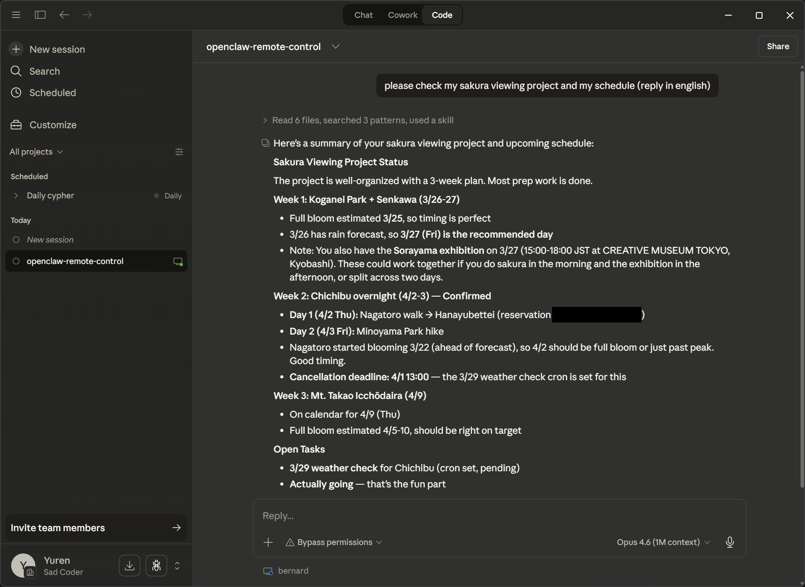

# Claude Remote Control 與 OpenClaw 的整合

發現 Claude Code 多了 remote control 的功能後，我靈機一動想到，只要在同一個 workspace 加上 remote control，那不就可以從 Claude App 跟 Discord 都跟我的 AI agent 對話了嗎？所以我跟我的 OpenClaw agent 說：「幫我用這個指令建一個 daemon。」

```
claude remote-control --permission-mode bypassPermissions
```

指定好 workspace 目錄，OpenClaw 就幫我建了一個叫 "Claude remote" 的常駐服務跑起來了。然後我打開手機上的 Claude App，連進去就出現了一個亮起綠燈的 session 就可以跟它對話了。

這台 VPS 上所有的資源 Claude 都可以動用，跟原本 OpenClaw 的能力一模一樣。所有 credential 放在 1Password 的 vault 裡，agent 需要的時候才存取。不是在檔案系統裡面，所以 bypassPermissions 對我來說是可以接受的風險。

整個設定過程不到十分鐘。

## 第一印象：這還是 Claude Code，不是 OpenClaw

剛開始用的時候，體驗跟一般的 Claude Code 幾乎沒有差別。可以寫程式、改檔案、跑指令。但就是少了那種第一次使用 OpenClaw 的驚豔感。OpenClaw 跟 Claude Code 幾乎具備一樣的能力，但 Claude Code 幫我**寫程式**，而 OpenClaw 則是幫我**解決問題**，透過自己可以寫程式的能力創造工具來達成。

第一個我察覺到的差異是 Claude Code 並沒有採用 OpenClaw 架構好的 markdown 檔案作為 prompt。

OpenClaw 在啟動的時候，會動態地把 Workspace 目錄裡的各種 `.md` 檔合併在一起，再加上目前可用的 tools 組成一份完整的 system prompt。這份 prompt 裡面有你的偏好、你的記憶、你的技能清單、你的工具設定，同時也有 AI Agent 對自己定位的描述，而 Claude Code 並不會讀取這些檔案。

[DataCamp 的比較文章](https://www.datacamp.com/blog/openclaw-vs-claude-code)用了一個蠻精準的框架：Claude Code 是「safe, reliable, and specialized」，OpenClaw 是「general-purpose, messy, and expansive」。這個差距，在 remote control 的第一印象裡體現得非常明顯。

## 橋接：一份 CLAUDE.md 的距離

所以我請 Claude 做了一件事：研究 OpenClaw 的 system prompt 結構。

它看完之後，我請它幫忙寫一份 `CLAUDE.md`，把 OpenClaw 那套 prompt 架構翻譯成 Claude Code 能理解的格式。這份 `CLAUDE.md` 大概長這樣：

```markdown
# CLAUDE.md

## 執行環境

這個 workspace 由 Claude Code 和 OpenClaw 共用：
- Claude Code：目前的執行載體，負責互動對話與任務執行
- OpenClaw：同一台機器上運行，負責排程任務和通知
- 兩邊共用同一份檔案（記憶、人格設定、工具清單等）

## 開始對話前

先讀以下檔案取得完整脈絡：
1. SOUL.md — 人格與溝通風格
2. USER.md — 使用者背景
3. TOOLS.md — 環境設定、API、本地工具筆記
4. MEMORY.md — 長期記憶

## 專案結構

├── memory/          # 每日筆記
├── 10-projects/     # 進行中的專案
├── 30-resources/
│   ├── skills/      # 自訂技能
│   ├── cron-jobs/   # 排程任務
│   └── scripts/     # 工具腳本
└── canvas/          # 工作草稿區
```

寫完 `CLAUDE.md` 之後，已經有點像了。接著我把 OpenClaw 的 skills 目錄建立一個 symbolic link 到 .claude/skills，重啟 remote control 後，一切都變得熟悉了。

Claude 開始讀我的記憶檔案，開始用我寫的技能，開始用我習慣的語氣回覆。它的行為跟原本的 OpenClaw 已經非常接近了，特別是可以用 [playwright-cli](https://github.com/microsoft/playwright-cli) 作為瀏覽器之後，每次 Claude Code 的 WebFetch 都要停下來詢問的煩躁感降低了不少。

這也讓我感到意外，一份 `CLAUDE.md` 加上一個 skills 的 symlink，橋接的門檻比我預期低很多。

## 模型廠商的推進

橋接完成後，我開始在 Claude App 上跟它互動。跟在 discord/slack 上不一樣的地方是 Claude app 原生就設計是跟 agent 對話的界面，所以在跟 agent 的互動如使用工具的呈現還是比起原本給人與人之間溝通工具的詢軟體體要好上一點。有個有趣的發現是 discord 跟 slack 都不能中斷對方的執行動作（比如說要對方閉嘴），畢竟傳訊軟體從來沒有需要這樣的功能，但 Claude app 上是可以停止 agent 的執行動作的。



還有些新的界面功能目前還沒辦法在 Claude Code 上面用，比如 Chat 界面現在已經可以有[互動式圖解](https://www.youtube.com/watch?v=Ii99RU3mOJM)來解釋一些概念，這些工具如果之後都可以用在類似 OpenClaw 這種通用 Agent 的話會更加方便。通用的傳訊軟體如果要加入的話，會需要修改的幅度還是比起專用軟體要更大一些。

Anthropic 最近密集推出了三個相關功能。[Remote Control](https://code.claude.com/docs/en/remote-control) 讓你從手機或瀏覽器連回本機的 Claude Code session。[Channels](https://code.claude.com/docs/en/channels) 讓外部平台（Telegram、Discord）的事件推進 Claude Code session，做到事件驅動的自動化。[Dispatch](https://www.forbes.com/sites/ronschmelzer/2026/03/20/claude-dispatch-lets-you-control-claude-cowork-with-your-phone/) 則是 Claude Desktop 的 Cowork 功能延伸，讓你在手機上指派任務給桌機。三個功能合在一起，Anthropic 想把 Claude Code 從「坐在桌前才能用的 IDE agent」變成「隨時可以 reach 的 agent partner」。

Wharton 商學院教授 Ethan Mollick 在 Dispatch 上線後[在 X 上說](https://x.com/emollick/status/2034067677157679379)，Dispatch 已經能滿足他 90% 原本用 OpenClaw 做的事。雖然我還是更常使用 OpenClaw，但確實可以感受到差距在縮小。

## 缺漏的功能與扎實的基礎建設

但這差一點到底還差在哪裡？

我在 Slack/Discord 上用 OpenClaw 的時候，不同的工作會開在不同的頻道。寫文章在一個頻道，專案管理在另一個頻道，每個頻道裡還可以用 thread 來聚焦討論。Claude App 目前只有一個 session。不能新增第二個 session 來平行處理不同的工作，甚至不能 `/new` 清除 session 記憶。

排程也是一個缺口。OpenClaw 有完整的 cron job 系統，可以設定排程任務自動執行。Claude Code 有 `loop` 指令可以做簡單的重複，但跟排程工具的能力差距很大。Claude Desktop 版已經有 schedule 功能了，只是在 remote control 這個架構上還沒打通。

手機版的體驗也有打磨空間。每次從手機連回 session，都要等一段時間才能看到對話內容，看起來是沒有快取，每次都要重新載入。

但這些終究都是「還沒作」，而不是「作不到」。

做完這個嘗試之後，我感到做 LLM 的廠商，其實已經有做到跟 OpenClaw 非常接近的成品所需要的基礎建設了。差的只是他們的注意力放在哪裡、要往哪個方向前進的問題。

一份 `CLAUDE.md`，一個 skills 的 symlink，一行啟動指令。如果這樣就能做到六七成的 OpenClaw，那就代表基礎建設已經很扎實了，問題反而變成涉足這個領域對他們是否有戰略上的價值。

但或許反過來說，他們之前曾經嘗試過，只是過於謹慎，而 OpenClaw 的出現與市場反應，給了他們更多的信心可以往這邊前進。

## 實驗的價值所在

我們團隊每天都在用 OpenClaw。每個成員拿它當工作跟生活的助手，公司庶務也放在 Slack 裡用 OpenClaw 處理，從請假、行事曆到點子管理。但我們也不排斥嘗試其他工具，這也是為什麼會嘗試著用 Claude remote control。

OpenClaw 本質上是一個大膽的實驗。它給了 agent 一台完整的電腦，讓它自由地去解決問題。這很危險，安全性有很多疑慮。但在危險底下，有很多有趣的事情在發生。

即使安全性有問題，這類實驗還是帶來了價值。就像是人類第一次把火作為工具一樣，它既不穩定又危險，但是在這個混亂與手忙亂之中，還是有人可以注視著火把，腦袋不停翻轉著看到未來各種已知用火的景象。

很慶幸有 OpenClaw 這樣的專案出現。如果你問問身旁不是在這個業界的朋友，會發現其實使用的人少之又少。而很幸運自己有機會能夠一瞥未來的世界，並且重新思考，如果生活過度的便利，那麼留下最終有價值的事物是什麼？

這些事情並不是讓你的 Agent 進行深度研究就可以探索到的答案，而是每個人內心都得深深思索後，得出自己的結論。